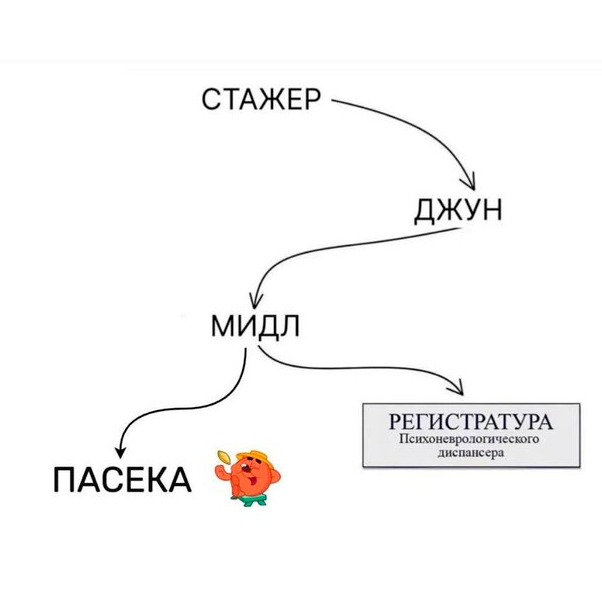

# Крушители²
Моя игра на Godot, сделанная для школьного проекта.
### Сборка
1. Скачайте последнюю версию Godot Engine (https://godotengine.org/download/)
> [!NOTE]  
> Если в игре происходят непредвиденные ошибки, попробуйте версию Godot Engine 4.6.2. Именно на этой версии я сейчас сижу.
2. Скачайте исходник
- ``git clone https://github.com/Fugach/Crashers-Squared``

  либо
- Сверху зелёная кнопка "Code" -> "Download ZIP" -> распаковать архив куда вам удобно
3. Запустите Godot Engine -> сверху кнопка "импорт"/"import" -> дошагайте до папки с исходником (в этой папке должен быть файл ``project.godot``!!!) -> снизу кнопка "Выбрать эту папку"/"Choose this folder"
4. Следуйте инструкциям на экране. В списке проектов появится мой проект.
5. Двойной клик ЛКМ по проекту или справа кнопка "Редактировать"/"Edit"
6. Откроется редактор -> сверху кнопка "Проект"/"Project" -> "Экспортировать..."/"Export..."
7. В открывшемся окне выберите предустановку для нужной системы, напишите имя исполняемому файлу и нажмите внизу окна "Экспортировать проект..."/"Export project..."
8. Выберите папку и всё! Запускаемый файл игры готов!

> [!TIP]
> Некоторые GPU не поддерживают Vulkan. Но вы можете изменить движок рендера на OpenGL. При этом графика станет хуже, а производительность может сильно изменится. В редакторе в правом верхнем углу переключите режим "Forward+" на "Совместимость"/"Compatibility".
#
Сергей Игоревич, это правда?

